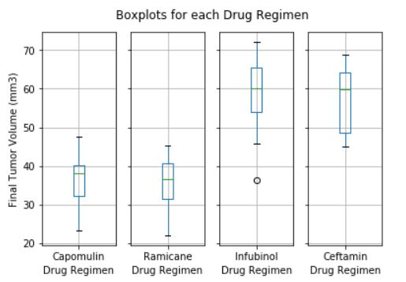
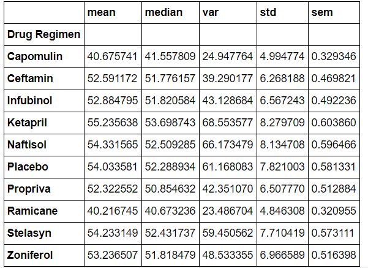

# Mouse Study Matplotlib Plotting Practice

## Description
A fictional anti-cancer pharmaceutical company is testing a new potential treatment for squamous cell carcinoma (SCC), a commonly occuring form of skin cancer.
## Objective
The purpose of this project was to compare the performace of a certain drug of interest, Capomulin, versus the other treatment regimens. 
## Measurement
Each mouse had one of 10 drug regimens administered prior to taking it's tumor volume. Then, each mouse had it's tumor volume measured at 10 different timepoints. Final tumor volume was used as an indicator of whether a drug was successful or not in treating SCC.
## Results
Statistical summaries suggest that Capomulin may be a superior drug regimen over the other treatments. Of the four most promising drug regimens, Capomulin and Ramicane had the lowest mean final tumor volume.

## Changes in tumor vol
